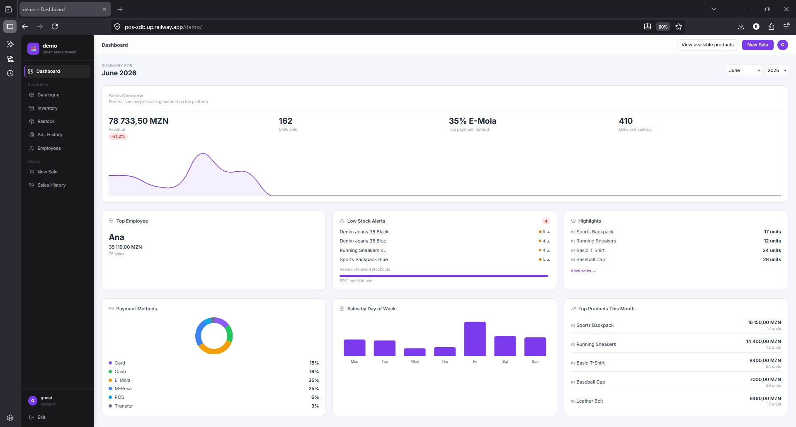
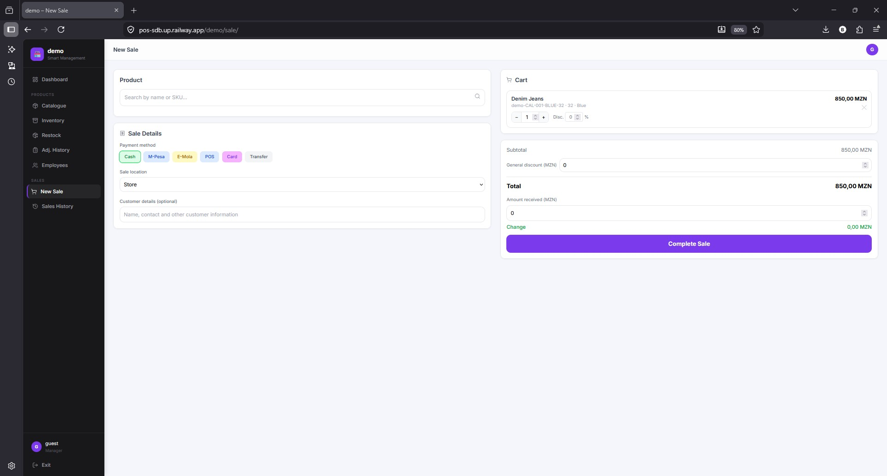
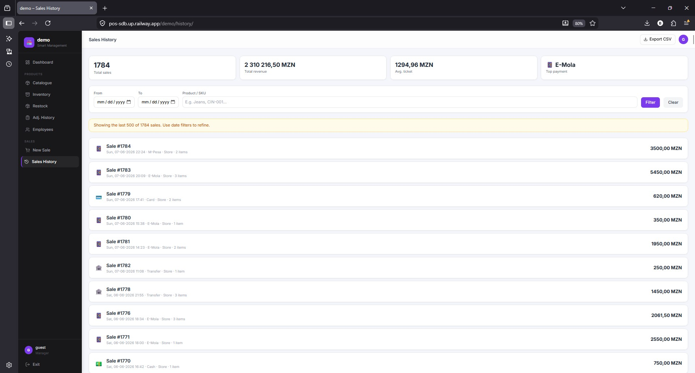

# SGI — Smart Management Interface

> A production-grade, multi-tenant Point of Sale system built with Django and Vanilla JS.
> Deployed on Railway with PostgreSQL, Gunicorn, and WhiteNoise.

**[Live Demo →](https://pos-sdb.up.railway.app/demo/)**
No login required — opens directly as a working demo store.

---

## What this is

SGI is a full-featured POS and inventory management system built for retail stores. The architecture is multi-tenant from the ground up: each store lives at its own URL prefix (`/store-name/`), all data is isolated at the query layer, and a middleware pipeline handles tenant resolution, auth gating, and demo auto-login on every request.

The frontend is entirely API-driven — no page reloads, no framework overhead. Every interaction (product search, cart management, sale completion, stock updates) is a fetch call against a JSON API with optimistic UI and toast feedback.

---

## Screenshots

| Dashboard | New Sale | Sales History |
|---|---|---|
|  |  |  |

---

## Feature set

**Sales**
- Product search with live filtering by name, SKU, size, colour, and category
- Cart with per-item discounts, flat order discount, and change calculation
- Multiple payment methods — Cash, M-Pesa, E-Mola, POS, Card, Transfer
- Receipt modal on completion; sale void with automatic stock rollback

**Analytics dashboard**
- Monthly KPIs: revenue, units sold, top payment method, total inventory
- Revenue vs previous month change badge
- Daily revenue line chart, sales-by-weekday bar chart, payment method donut (Chart.js)
- Top products and top employee widgets; low stock alert panel

**Inventory & catalogue**
- Live stock view with in-stock / low / out-of-stock filters
- Catalogue with inline edit modals (name, size, colour, price, stock, category)
- Bulk restock with pending-changes preview before committing
- Stock adjustment logging by reason (Damage, Loss, Theft, Other) with full audit history

**Employees**
- Create staff accounts with auto-generated credentials
- Credential reset; role-based access (Manager vs Attendant)

**Data**
- Date-range and product filters on sales history
- CSV export with metadata header and summary footer

---

## Tech stack

| Layer | Technology |
|---|---|
| Backend | Python 3, Django 5 |
| Database | PostgreSQL (Railway) · SQLite for local dev |
| Frontend | Vanilla JS (ES2020), Tailwind CSS, Lucide icons, Chart.js |
| Auth | Django sessions — tenant-scoped, 8-hour TTL |
| Deployment | Railway, Gunicorn, WhiteNoise |
| Dev tooling | Claude Code `PostToolUse` hook for tenant-isolation checks |

---

## Architecture

### Multi-tenancy

Slug/path-based. Every URL is prefixed with the store slug (`/<subdomain>/sale/`, `/<subdomain>/api/dashboard`, etc.). `TenantMiddleware` strips the first path segment, resolves the `Tenant` record, and attaches it to `request.tenant`. All querysets are manually scoped to that tenant — explicit by design, no hidden ORM magic.

A second middleware (`DemoAutoLoginMiddleware`) handles demo auto-login so the live demo opens without credentials.

### Tenant-isolation guard

A Claude Code `PostToolUse` hook ([`.claude/hooks/check_tenant_scope.py`](.claude/hooks/check_tenant_scope.py)) fires on every Python file edit and warns if a queryset on a store-scoped model is missing its tenant filter. The check runs at authoring time, before code review, so cross-tenant data leaks are caught immediately.

### API design

All reads and mutations go through typed JSON endpoints (`/api/sale`, `/api/catalogue`, `/api/dashboard`, etc.). Views are thin render wrappers; all data flows through fetch. CSRF tokens are injected into every state-mutating request header.

### Performance

Three targeted database indexes (migration `0017`) cover the heaviest query paths:

- `Sale(tenant, created_at)` — all date-range filters and monthly dashboard aggregations
- `StockAdjustment(created_at)` — adjustment history list
- `ProductVariant(is_active)` — filtered on every catalogue and inventory load

`CONN_MAX_AGE=60` keeps PostgreSQL connections alive across Gunicorn requests, cutting per-request latency on Railway.

---

## v1.1.0 — What changed

A production-readiness pass shipped on 2026-06-08:

| Area | Change |
|---|---|
| Security | Tenant-isolation `PostToolUse` hook — catches cross-store query bugs at authoring time |
| Mobile | Responsive sidebar — hamburger toggle, overlay, auto-close on nav |
| UI | Lucide icons, Inter font, frosted-glass topbar, left-border active nav, skeleton loaders, card hover-lift |
| Data display | Neutral palette with coloured status dots replacing tinted rows and coloured text |
| Notifications | Global `showToast()` in base template — replaced all `alert()` dialogs |
| Performance | 3 DB indexes + `CONN_MAX_AGE=60` |

Full notes in [CHANGELOG.md](CHANGELOG.md).

---

## Running locally

```bash
git clone https://github.com/Dr-SdB/pos-system.git
cd pos-system

python -m venv .venv && source .venv/bin/activate   # Windows: .venv\Scripts\activate
pip install -r requirements.txt

cp .env.example .env   # set SECRET_KEY and DB_* vars
python manage.py migrate
python manage.py seed_sample_data   # optional — loads demo products and sales
python manage.py runserver
```

---

Built by [Shelton de Brito](https://github.com/Dr-SdB) · [Live demo](https://pos-sdb.up.railway.app/demo/) · MIT License
